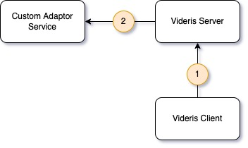
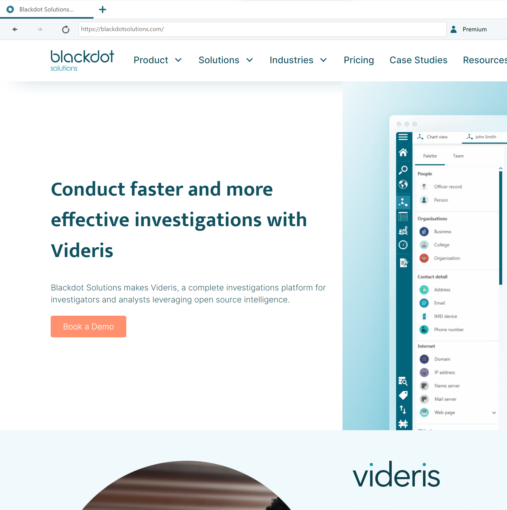
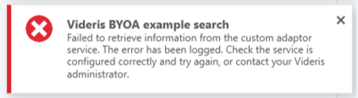
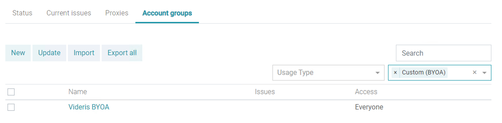

Videris Connector Framework Userguide

The Videris Connector Framework (VCF) enables customers to add their own data sources to Videris, for the first time ever.

This **Get Started guide** outlines how the VCF works and how to get up and running.

_Note: the VCF is sometimes referred to by its original name - Build Your Own Adaptor, or BYOA._

Contents
--------

*   [At a glance](#At-a-glance)
*   [Prerequisites](#Prerequisites)
*   [How it works](#How-it-works)
    *   [Discovering adaptors](#Discovering-adaptors)
    *   [Running adaptors](#Running-adaptors)
*   [Examples](#Examples)
    *   [Discovering adaptors](#Discovering-adaptors-1)
        *   [Request](#Request)
        *   [Response](#Response)
        *   [Notes](#Notes)
    *   [Running adaptors](#Running-adaptors-1)
        *   [Request](#Request-1)
        *   [Response](#Response-1)
        *   [Notes](#Notes-1)
    *   [Error handling](#Error-handling)
        *   [Integration errors](#Integration-errors)
        *   [Custom errors](#Custom-errors)
*   [Setting up Videris Server to use the VCF](#Setting-up-Videris-Server-to-use-the-VCF)
    *   [Videris Server configuration](#Videris-Server-configuration)
    *   [Creating an account group](#Creating-an-account-group)

* * *

At a glance
-----------

The Videris Connector Framework currently supports **custom** **searcher(s).** It enables users to bring search results from custom data sources into Videris for further investigation.

The VCF does not currently support enrichers - this feature will be added in future, subject to demand.

* * *

Prerequisites
-------------

Customers wishing to use the VCF will need some technical expertise and development resources.

Specifically, they will need to be able to:

*   Create a service providing endpoints which conform to our [OpenAPI specification](https://build.bds-tools.com/job/CollectionServer/job/master/lastSuccessfulBuild/artifact/Docs/BYOASpecification.json). This specification is available on request. The service will need to be accessible to their Videris Server.
    
*   Collect data from the desired data source(s), and process that data into the required format.
    
*   Provide maintenance support for as long as they intend to use the desired data source(s).
    

* * *

How it works
------------

To use the VCF, the customer organisation will need to create a _Custom Adaptor Service_ with at least two API endpoints:

1.  _**GET {base url}/searchers**_
    
    *   This endpoint allows Videris to retrieve details of the custom searcher(s) available.
        
    *   We call this **discovering** **adaptors**.
        
2.  _**GET {base url}/searchers/\[searcherId\]/results**_
    
    *   This endpoint allows Videris to retrieve search results from a specific custom searcher.
        
    *   We call this **running** **adaptors**.
        

Where multiple searchers are created, each searcher will need its own results endpoint.

### Discovering adaptors

Discovering adaptors is a two stage process, each of which happen independently.

1.  On start up, Videris Server requests the details of available custom adaptors, from the Custom Adaptor Service
    
    *   Uses _**GET {base url}/searchers.**_
        
2.  On user log-in, Videris client requests the details of available custom adaptors, from the Videris server
    


### Running adaptors

Running adaptors is also a two stage process. In this case, step 1 will trigger step 2.

1.  Videris client requests Videris Server to _run_ a specified adaptor
    
2.  Videris Server requests the Custom Adaptor Service to _run_ a specified adaptor
    
    *   Uses _**GET {base url}/searchers/\[searcherId\]/results**_
        
    *   Results/errors are returned to the client
        



* * *

Examples
--------

Full descriptions, requirements and recommendations are listed in [the OpenAPI specification.](https://build.bds-tools.com/job/CollectionServer/job/master/lastSuccessfulBuild/artifact/Docs/BYOASpecification.json) This is available on request. We suggest copying the contents into [https://editor.swagger.io/](https://editor.swagger.io/).

The examples in this guide were created using [https://docs.beeceptor.com/docs/features-mocking-rules/](https://docs.beeceptor.com/docs/features-mocking-rules/).

### Discovering adaptors

#### Request

[https://videris-byoa.free.beeceptor.com/searchers](https://videris-byoa.free.beeceptor.com/searchers)

#### Response

```json
[
  {
    "id": "videris-byoa-id",
    "name": "Videris BYOA example",
    "hint": "Hint text",
    "tooltip": "Tooltip text"
  }
]
```

This example searcher is displayed in Videris Search under the **Databases** category, as follows:


#### Notes

*   There are no input parameters - this endpoint should return all available searchers.
    
*   In this example, we only return one searcher, but multiple searchers can be returned.
    
*   If multiple searchers are returned, they will be listed in alphabetical order by name.
    

### Running adaptors

#### Request

[https://videris-byoa.free.beeceptor.com/searchers/videris-byoa-id/results?query=demo&maxResults=100](https://videris-byoa.free.beeceptor.com/searchers/videris-byoa-id/results?query=test&maxResults=100)

#### Response

```json
{
    "searchResults": [
  {
    "key": "89ED7AB4-D987-E69C-0AC5-A8C5C5B0EAB3",
    "title": "Title of the search result",
    "subTitle": "Subtitle of the search result",
    "summary": "Summary of the search result",
    "source": "Videris BYOA",
    "entities": [
      {
        "id": "466c3419-c0f0-4aae-b56e-303860dacfea",
        "type": "EntityBusiness",
        "attributes": {
          "Name": "Blackdot Solutions"
        }
      }
    ],
    "url": "https://blackdotsolutions.com"
  }
]
}
```

For this example search result, Videris will:

*   use `title`, `subTitle` and `summary` to display the result in Videris Search as follows:
    


*   use `source` to categorise the result under the _Searchers_ quick filter
    


*   use `entities` to create an entity e.g. if the result is copied to a Chart.
    
    *   Note: every entity in Videris must have a unique `id` provided, and this must be in the _UUID_ format.
        


*   use `url`, if the the result is opened in a browser, as well as to deduplicate search results.
    



#### Notes

*   The `query` parameter will contain the string entered by the Videris user
    
*   The `maxResults` parameter will contain the number of results requested by the Videris user.
    
*   VCF does not currently support other adaptor options (e.g. search by date or region)
    
*   VCF searchers are currently supported only in Search mode (i.e. not supported in Cross-search, Due diligence, Phone or Address modes).
    
*   Multi-line searches in Videris will generate multiple requests (one per line).
    
*   Search results are deduplicated by `url` within Videris Search.
    
*   To make best use of `entities` in the response, please refer to the Videris entity ontology. This can be found using the _GET_ `https://[hostname]:30002/api/v1/entity-definitions` method as an authenticated user.
    
*   Multiple entities (and relationships) can be added for a single search result, if desired.
    
*   In this example, we only return one search result. If multiple search results are returned, they will be ranked according to Videris ranking logic.
    

### Error handling

#### Integration errors

When running searches, Videris will detect integration errors and display the following error:



Scenarios handled in this way include:

*   The endpoint requested by Videris could not be found.
    
*   The endpoint requested by Videris did not respond within timeout limit (100s).
    
*   The response contained invalid json (e.g. a search result contains an invalid entity id).
    

The details of the specific error can be found in the Data Integration Service logs.

#### Custom errors

Customised error text can be used if you wish to report a particular error to the user (e.g. an error collecting results):

```json
{
  "searchResults": [],
  "errors": [
    {
      "message": "This is an error"
    }
  ]
}
```

This is displayed in Videris as follows:


* * *

Setting up Videris Server to use the VCF
----------------------------------------

### Videris Server configuration

This is required before custom adaptors can be discovered or run.

1.  Navigate to `[hostname]:3000/config` and authenticate.
    
2.  On the **Configuration** tab, scroll to the **Collection** section and ensure **Custom Adaptors** is checked.
    
3.  Enter the _{base url}_ for the custom adaptor service (e.g. [https://videris-byoa.free.beeceptor.com](https://videris-byoa.free.beeceptor.com/)) in the **Custom Adaptors URL** box.
    
4.  Scroll up to the top and **Apply configuration**. This should reset the server - if it doesn't, you will need to do this manually.
    

Once configured, the relevant section of the configuration site should look something like this:


Note: after the Data Integration Service (DIS) starts, it can take up to 5 minutes for any changes to the custom adaptor service to be reflected in Videris. This is due to caching policies on Videris Server.

To restart DIS only, rather than resetting the server, use the following cli commands:

*   ```bash
    kubectl scale --replicas=0 deploy/data-integration
    ```
    
*   ```bash
    kubectl scale --replicas=1 deploy/data-integration
    ```
    

To check the gateway metadata current caching policy:

*   ```bash
    kubectl set env deploy/gateway --list
    ```
    

To set the gateway metadata caching policy to zero:

*   ```bash
    kubectl set env deploy/gateway GATEWAY__METADATACACHEMINUTES=0
    ```
    

To set the gateway metadata caching policy back to the default again:

*   ```bash
    kubectl set env deploy/gateway GATEWAY__METADATACACHEMINUTES-
    ```
    

### Creating an account group

This is required before custom adaptors can be run.

1.  Navigate to `https://[hostname]:30002/data-collection/account-groups` and authenticate.
    
2.  Select the **New** button to add a new account group.
    
3.  Enter a **name** and **proxy type** selection (typically **None**).
    
4.  Under Add data providers, select **Custom (BYOA)**.
    
5.  Click **Add** to save the new account group.
    
6.  Navigate to `https://[hostname]:30002/data-collection/account-groups?p=45`. You should see the account group which was just added listed in the table.
    


